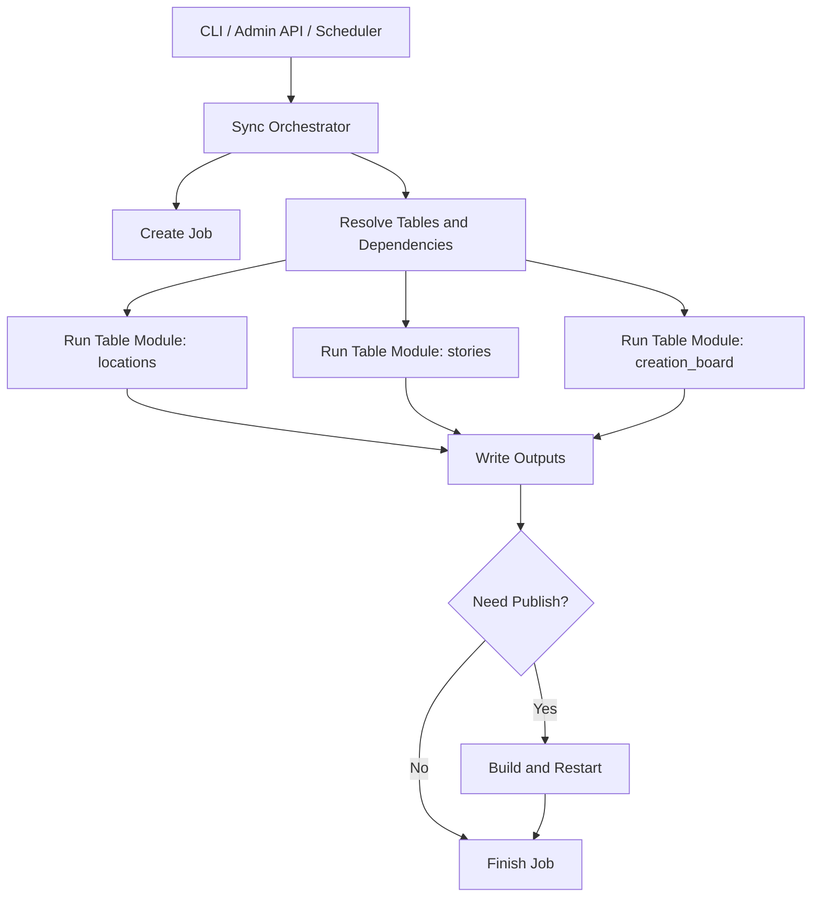

# 数据同步系统设计（服务器版草案）

> 版本：v0.5
> 状态：v1 已落地并持续修订
> 日期：2026-04-21
> 适用前提：自托管服务器、单实例 Next.js / Node.js 常驻进程

## 1. 背景

当前仓库已经具备一条可运行的数据同步链路：

- CLI 入口：`src/scripts/sync-feishu.ts`
- 核心逻辑：`src/lib/sync-service.ts`
- 后台接口：`src/app/api/admin/sync/route.ts`
- 定时任务：`src/lib/admin/scheduler.ts`
- 配置读写：`src/lib/admin/config.ts`
- 当前前端消费产物：
  - `src/config/locations.json`
  - `src/data/content.json`
  - `src/data/creation-board.json`

当前同步链路已经能完成：

1. 从飞书读取地点、故事、创作公示板数据。
2. 处理附件并上传到 OSS。
3. 回写部分 OSS URL 到飞书。
4. 输出前端直接消费的本地 JSON 文件。
5. 通过后台页面手动触发同步，或通过 `node-schedule` 做定时同步。

但现状也有几个明显问题：

1. `sync-service.ts` 过于集中，客户端、转换逻辑、写文件、OSS 处理、飞书回写都耦合在一起。
2. `/api/admin/sync` 目前是轻量 action 接口，能用，但不适合继续扩展。
3. 目前只能按“整条流程全跑”思考，不能自然表达“只同步某一张表”。
4. 新增一张飞书表时，基本要复制大段逻辑，扩展成本高。
5. 同步任务没有统一的 job 模型，后台只能看到一个粗粒度状态。
6. 运行期状态写在 `src/config` 下，会和源码、构建产物、版本管理边界混在一起。

## 2. 部署假设

这份设计文档明确采用以下前提：

1. **部署环境是自购服务器**
2. **运行模式是单实例常驻 Node 进程**
3. **后台同步任务允许在请求返回后继续执行**
4. **本地文件系统可作为 v1 的运行期状态存储**
5. **定时任务继续使用 `node-schedule`**

这意味着：

1. 本轮设计**不再把 Vercel 兼容性作为主约束**。
2. v1 **不必引入数据库、Redis、外部队列**。
3. `runtime/`、`logs/`、job store、file lock 都可以直接采用本地文件方案。

同时要明确边界：

1. `node-schedule` 只适合**单实例常驻进程**。
2. 如果未来改成多实例、横向扩容、蓝绿部署或容器编排，需要再迁移到外部调度器或分布式锁。

## 3. 当前最大的真实风险

服务器环境解决了“运行时文件系统不可持久化”的问题，但新的首要风险变成了：

> **同步任务写入了新的 JSON，不代表线上页面一定会立即读取到这些新文件。**

### 3.1 原因

当前前端存在多处静态 import JSON：

- [InteractiveMap.tsx](D:/MyProject/TimeLetter/HNU-TimeLetter/src/components/desktop/InteractiveMap.tsx)
- [QuillSearch.tsx](D:/MyProject/TimeLetter/HNU-TimeLetter/src/components/desktop/QuillSearch.tsx)
- [MobileExperience.tsx](D:/MyProject/TimeLetter/HNU-TimeLetter/src/components/mobile/MobileExperience.tsx)
- [StaticMapModal.tsx](D:/MyProject/TimeLetter/HNU-TimeLetter/src/components/mobile/StaticMapModal.tsx)
- [StoryFeed.tsx](D:/MyProject/TimeLetter/HNU-TimeLetter/src/components/mobile/StoryFeed.tsx)
- [creation/page.tsx](D:/MyProject/TimeLetter/HNU-TimeLetter/src/app/creation/page.tsx)

服务端也有静态 import 配置：

- [sync.ts](D:/MyProject/TimeLetter/HNU-TimeLetter/src/server/feishu/sync.ts)

这意味着：

```text
同步任务运行时更新 src/data/*.json
!=
生产页面一定立刻展示新内容
```

### 3.2 当前设计决策

因此当前版本先明确采用：

```ts
export type DataPublishMode =
  | 'build_time'
  | 'runtime_api';

const DATA_PUBLISH_MODE: DataPublishMode = 'build_time';
```

也就是：

1. `src/data/*.json` 和 `src/config/locations.json` 当前视为**构建期数据**。
2. 同步完成不等于线上页面已更新。
3. 必须经过 build + restart，才算真正发布。

## 4. 设计目标

### 4.1 目标

1. 提供一个明确的后端接口，用于触发手动同步。
2. 将 CLI、后台接口、定时任务统一到同一套同步入口。
3. 支持可选表格同步，而不是只能全量跑。
4. 让“新增一张表”变成注册模块，而不是继续膨胀单文件。
5. 保留当前已有的飞书读取、OSS 上传、结果写文件能力。
6. 增加任务状态、步骤状态、日志摘要，便于后台展示和排查。
7. 明确“同步数据”和“同步并发布”是两件不同的事。

### 4.2 非目标

这一阶段暂不做：

1. 飞书 webhook 增量同步。
2. 分布式任务队列。
3. 多实例任务协调。
4. 运行时 API 数据读取全量切换。
5. 大规模权限系统重构。

## 5. 核心结论

当前服务器版主线方案建议采用三层结构：

1. **触发层**：CLI、后台 API、Scheduler。
2. **编排层**：`SyncOrchestrator`，负责 job、依赖解析、步骤执行、状态记录。
3. **模块层**：按表拆分的 `TableSyncModule`，每张表一个模块。

同时引入四个关键概念：

1. **Job 模型**：每次同步都是一个 job，有自己的状态、参数、步骤、结果。
2. **Table Registry**：把“可同步的表”注册成一个模块清单，后续新增表只接入 registry。
3. **发布策略**：同步完成后是否立即 build / restart，是独立决策。
4. **数据发布模式**：当前版本固定为 `build_time`，未来可演进到 `runtime_api`。

## 6. 两条路线与当前选择

### 6.1 路线 A：构建期 JSON

流程：

```text
飞书同步
  -> 写 src/data / src/config
  -> build
  -> restart
  -> 线上页面使用新数据
```

优点：

1. 最贴合当前项目结构。
2. 前端改动最小。
3. 页面性能和稳定性更好。
4. 故障面主要集中在同步和构建阶段。

缺点：

1. 同步后不是立即生效。
2. 每次发布都要 build。
3. 需要处理 build 失败与回滚。

### 6.2 路线 B：运行期数据读取

流程：

```text
飞书同步
  -> 写 runtime/data
  -> 前端通过 API 或运行时读文件
  -> 页面刷新后看到新数据
```

优点：

1. 同步后可以即时生效。
2. 不需要每次 rebuild。
3. 更接近真正 CMS。

缺点：

1. 要改前端数据读取方式。
2. 要增加 API、缓存、错误兜底、加载状态。
3. 会把这轮“同步系统重构”扩大成“同步系统 + 前端数据层 + 发布模型”一起改。

### 6.3 当前推荐

**v1 明确选路线 A，路线 B 只做预留，不在本轮落地。**

理由：

1. 当前架构天然偏路线 A。
2. 这轮优先把同步系统做实，而不是同时重构前端数据层。
3. 路线 B 更适合作为 v2 / v3 的 CMS 化方向。

## 7. 数据发布策略

### 7.1 v1 的 job 类型

```ts
export type SyncJobKind =
  | 'sync-data'
  | 'sync-data-and-publish';
```

语义：

- `sync-data`
  - 只拉飞书、处理 OSS、写 JSON
  - 数据已同步到服务器，但不保证线上页面立即更新
- `sync-data-and-publish`
  - 同步完成后继续执行 build + restart
  - 完成后线上页面应当使用新数据

### 7.2 后台按钮建议

后台建议明确分成两个操作：

1. **同步数据**
2. **同步并发布**

这样比把“是否发布”藏在某个勾选项里更清楚。

### 7.3 发布状态

建议 job 增加以下字段：

```ts
export interface SyncJobRecord {
  status: SyncJobStatus;
  publishStatus?: 'not_required' | 'pending' | 'building' | 'published' | 'publish_failed';
  syncedAt?: string;
  publishedAt?: string;
}
```

推荐语义：

- `sync-data`
  - `publishStatus = 'pending'`
  - 表示数据已同步，但尚未发布
- `sync-data-and-publish`
  - 发布开始时 `publishStatus = 'building'`
  - 发布成功后 `publishStatus = 'published'`
  - 发布失败时 `publishStatus = 'publish_failed'`

后台 UI 需要能明确展示：

1. 已同步但未发布
2. 发布中
3. 发布成功
4. 发布失败，但线上仍使用旧版本

### 7.4 发布阶段的责任边界

建议把“发布”看作同步 job 的一个可选后置阶段，而不是塞进表模块本身。

也就是说：

```text
表模块负责数据同步
发布阶段负责 build / restart
```

不要让 `stories.module.ts` 或 `creation-board.module.ts` 知道如何构建或重启服务。

### 7.5 发布脚本而不是内联命令

不建议简单地在后台接口里直接拼：

```bash
npm run build
pm2 restart app
```

更推荐把“发布”做成独立脚本，由 publisher 触发。

推荐流程：

```text
1. 获取发布锁
2. 同步飞书数据
3. 写入 src/data / src/config
4. 校验 JSON
5. 执行 next build
6. build 成功后重启服务
7. 健康检查通过后标记 published
8. build 失败则保留旧服务继续运行
```

核心要求：

> **build 失败不能影响当前线上版本。**

### 7.6 package script 的语义调整建议

当前 [package.json](D:/MyProject/TimeLetter/HNU-TimeLetter/package.json) 中：

```json
{
  "build": "npm run sync && next build"
}
```

为了避免后台“同步并发布”时发生重复同步，建议后续将脚本语义拆开：

```json
{
  "sync": "tsx src/scripts/sync-feishu.ts",
  "build": "next build",
  "build:with-sync": "npm run sync && npm run build",
  "publish": "npm run sync && npm run build"
}
```

原则是：

1. `sync`：只同步数据
2. `build`：只构建
3. `publish`：同步 + 构建 + 发布

### 7.7 更稳的发布目录预留

如果后续想把发布做得更稳，可以演进到 release 目录模式：

```text
/opt/hnu-timeletter/
  current -> releases/20260421_153000
  releases/
    20260421_153000/
    20260420_210000/
  shared/
    runtime/
    logs/
```

这样可以做到：

1. 新版本 build 成功后再切换 `current`
2. build 失败时当前线上版本保持不动
3. 后续更容易做回滚

## 8. 现状与问题拆解

### 8.1 当前同步入口

目前已经存在三个入口，但它们没有统一抽象：

- `npm run sync` -> `src/scripts/sync-feishu.ts`
- 后台 `POST /api/admin/sync`，使用 `action=trigger`
- `scheduler.ts` 直接调用 `runSyncTask()`

建议后续统一成：

- CLI 调 `runSyncJob()`
- API 调 `createSyncJob()`
- Scheduler 调 `createSyncJob({ triggeredBy: 'scheduler' })`

### 8.2 当前同步服务的问题

`src/lib/sync-service.ts` 目前同时承担了：

1. 环境变量读取
2. 飞书 token 获取
3. 飞书表查询
4. 飞书附件下载
5. OSS 上传
6. 飞书回写
7. 数据转换
8. 文件写入
9. 控制台日志

短期能跑，但继续往里面加新表和新选项，复杂度会迅速失控。

### 8.3 当前后台接口的问题

目前 `POST /api/admin/sync` 是：

```json
{ "action": "trigger" }
```

或：

```json
{ "action": "update", "enabled": true, "cron": "0 0 * * *" }
```

这种写法的问题是：

1. 同一个接口既管配置又管执行，职责混在一起。
2. action 字段扩展多了之后会越来越难维护。
3. 没有 job id，前端只能轮询同一个全局状态。
4. 没法自然表达“只同步 locations 和 stories”。

## 9. 目标架构

### 9.1 总体流程



### 9.2 推荐目录

```text
src/
  app/api/admin/sync/
    config/route.ts
    jobs/route.ts
    jobs/[jobId]/route.ts
  lib/sync/
    index.ts
    types.ts
    orchestrator.ts
    registry.ts
    config.ts
    job-store.ts
    lock.ts
    logger.ts
    clients/
      feishu-auth-client.ts
      feishu-bitable-client.ts
      feishu-drive-client.ts
      oss-client.ts
    shared/
      asset-processor.ts
      text.ts
      dates.ts
      files.ts
      field-reader.ts
    tables/
      locations.module.ts
      stories.module.ts
      creation-board.module.ts
    writers/
      json-writer.ts
      locations.writer.ts
      content.writer.ts
      creation-board.writer.ts
    publish/
      publisher.ts
      build-and-restart.ts
  scripts/
    sync-feishu.ts

runtime/
  admin/
    sync-config.json
    sync-lock.json
    sync-jobs/
      <job-id>.json
logs/
  sync/
    <job-id>.log
```

说明：

1. `runtime/`、`logs/` 是运行期状态。
2. `src/data`、`src/config` 是当前前端消费产物。
3. “同步数据”和“发布”在目录结构上也应分层。
4. 当前版本不引入 `runtime/data`，但为后续路线 B 预留目录与接口命名。

## 10. 接口设计

### 10.1 配置接口

#### `GET /api/admin/sync/config`

用于读取当前同步配置与运行时摘要，但二者分开返回。

返回示例：

```json
{
  "config": {
    "enabled": true,
    "cron": "0 0 * * *",
    "defaultTables": ["locations", "stories", "creation_board"],
    "defaultJobKind": "sync-data",
    "dataPublishMode": "build_time"
  },
  "runtime": {
    "currentJobId": null,
    "lastJobId": "sync_20260421_100000_ab12cd",
    "lastRunAt": "2026-04-21T10:00:00.000Z",
    "lastPublishAt": "2026-04-21T10:10:00.000Z"
  }
}
```

#### `PATCH /api/admin/sync/config`

用于更新定时任务配置。

请求示例：

```json
{
  "enabled": true,
  "cron": "0 */6 * * *",
  "defaultTables": ["locations", "stories", "creation_board"],
  "defaultJobKind": "sync-data"
}
```

说明：

1. `config` 是可修改配置。
2. `runtime` 是只读运行状态。
3. 避免 PATCH 配置时误覆盖运行状态。

### 10.2 任务接口

#### `POST /api/admin/sync/jobs`

用于创建一个同步任务。

请求示例：

```json
{
  "kind": "sync-data",
  "tables": ["locations", "stories"],
  "dependencyMode": "read_local",
  "includeAssets": true,
  "continueOnTableError": false,
  "triggeredBy": "admin-ui",
  "note": "手动刷新首页相关数据"
}
```

返回示例：

```json
{
  "jobId": "sync_20260421_154500_x7k9p2",
  "status": "queued",
  "kind": "sync-data",
  "tables": ["locations", "stories"],
  "effectiveTables": ["locations", "stories"],
  "createdAt": "2026-04-21T15:45:00.000Z"
}
```

说明：

1. 建议返回 `202 Accepted`。
2. 服务器单实例模式下，允许“返回后后台继续执行”。
3. 前端通过 `GET /api/admin/sync/jobs/:jobId` 轮询状态。

#### `GET /api/admin/sync/jobs`

用于获取最近若干次任务。

#### `GET /api/admin/sync/jobs/:jobId`

用于获取单次任务详情。

返回示例：

```json
{
  "jobId": "sync_20260421_154500_x7k9p2",
  "kind": "sync-data-and-publish",
  "status": "success",
  "publishStatus": "published",
  "tables": ["locations", "stories"],
  "effectiveTables": ["locations", "stories"],
  "triggeredBy": "admin-ui",
  "createdAt": "2026-04-21T15:45:00.000Z",
  "startedAt": "2026-04-21T15:45:00.200Z",
  "syncedAt": "2026-04-21T15:45:18.000Z",
  "publishedAt": "2026-04-21T15:47:18.000Z",
  "finishedAt": "2026-04-21T15:47:18.000Z",
  "durationMs": 138000,
  "summary": {
    "locationCount": 5,
    "storyCount": 6,
    "creationIdeaCount": 0,
    "filesWritten": [
      "src/config/locations.json",
      "src/data/content.json"
    ],
    "published": true
  },
  "steps": [
    { "step": "locations", "status": "success" },
    {
      "step": "stories",
      "status": "success_with_warnings",
      "summary": {
        "totalRecords": 6,
        "successRecords": 5,
        "skippedRecords": 0,
        "failedRecords": 1
      }
    },
    { "step": "publish", "status": "success" }
  ],
  "warnings": [],
  "errors": []
}
```

### 10.3 兼容策略

为避免一次性改动过大，建议保留当前接口一段时间：

- 保留 `POST /api/admin/sync`
- 内部将 `action=trigger` 转发为 `POST /api/admin/sync/jobs`
- 内部将 `action=update` 转发为 `PATCH /api/admin/sync/config`

## 11. Job 模型

### 11.1 类型定义

```ts
export type SyncJobKind =
  | 'sync-data'
  | 'sync-data-and-publish';

export type SyncTableKey =
  | 'locations'
  | 'stories'
  | 'creation_board';

export type DependencyMode =
  | 'read_local'
  | 'run_dependencies'
  | 'strict';
```

### 11.2 Job 状态

- `queued`
- `running`
- `success`
- `partial_success`
- `failed`
- `canceled`

### 11.3 Step 状态

- `pending`
- `running`
- `success`
- `success_with_warnings`
- `skipped`
- `failed`

### 11.4 数据结构建议

```ts
export interface SyncRunRequest {
  kind?: SyncJobKind;
  tables?: SyncTableKey[];
  dependencyMode?: DependencyMode;
  includeAssets?: boolean;
  continueOnTableError?: boolean;
  triggeredBy?: 'admin-ui' | 'scheduler' | 'cli';
  note?: string;
}

export interface SyncJobRecord {
  jobId: string;
  kind: SyncJobKind;
  status: 'queued' | 'running' | 'success' | 'partial_success' | 'failed' | 'canceled';
  publishStatus?: 'not_required' | 'pending' | 'building' | 'published' | 'publish_failed';
  tables: SyncTableKey[];
  effectiveTables: SyncTableKey[];
  triggeredBy: 'admin-ui' | 'scheduler' | 'cli';
  createdAt: string;
  startedAt?: string;
  syncedAt?: string;
  publishedAt?: string;
  finishedAt?: string;
  durationMs?: number;
  steps: SyncJobStep[];
  summary?: Record<string, unknown>;
  warnings: string[];
  errors: string[];
}

export interface SyncJobStep {
  step: string;
  status: 'pending' | 'running' | 'success' | 'success_with_warnings' | 'skipped' | 'failed';
  startedAt?: string;
  finishedAt?: string;
  summary?: {
    totalRecords?: number;
    successRecords?: number;
    skippedRecords?: number;
    failedRecords?: number;
    filesWritten?: string[];
    [key: string]: unknown;
  };
  warnings?: string[];
  errors?: string[];
}
```

## 12. 可选表格同步设计

### 12.1 基本原则

同步不再默认等于“整条流程全跑”，而是由 `tables` 参数决定。

### 12.2 依赖处理

当前三张表的依赖关系建议如下：

| 表模块 | 是否独立 | 说明 |
| --- | --- | --- |
| `locations` | 是 | 直接生成 `src/config/locations.json` |
| `stories` | 半独立 | 需要地点坐标做映射；若未同步 `locations`，可使用本地已有 `locations.json` |
| `creation_board` | 是 | 独立输出 `src/data/creation-board.json` |

因此建议增加 `dependencyMode`：

- `read_local`
  - 只跑用户显式选择的表
  - 依赖从现有本地产物读取
  - 不自动执行依赖表
- `run_dependencies`
  - 依赖表也执行
  - 允许写依赖产物
- `strict`
  - 依赖缺失直接失败

推荐默认值：`read_local`

### 12.3 `includeAssets` 的精确定义

- `includeAssets = true`
  - 允许下载飞书附件
  - 允许上传 OSS
  - 允许回写飞书 OSS URL
- `includeAssets = false`
  - 不下载附件
  - 不上传 OSS
  - 不回写附件 URL
  - 只使用已有 `OSS_URL` / `URL` 字段

## 13. 表模块设计

### 13.1 统一接口

```ts
export interface TableSyncModule<TOutput = unknown> {
  key: SyncTableKey;
  label: string;
  dependsOn?: SyncTableKey[];
  run(ctx: SyncContext): Promise<TableSyncResult<TOutput>>;
}

export interface TableSyncResult<TOutput = unknown> {
  output?: TOutput;
  filesWritten?: string[];
  summary?: {
    totalRecords?: number;
    successRecords?: number;
    skippedRecords?: number;
    failedRecords?: number;
    [key: string]: unknown;
  };
  warnings?: string[];
}
```

### 13.2 Registry 作为唯一权威来源

```ts
export const tableRegistry = {
  locations: locationsModule,
  stories: storiesModule,
  creation_board: creationBoardModule,
} satisfies Record<SyncTableKey, TableSyncModule>;
```

以下内容都应从 registry 派生：

1. API 参数校验
2. 后台可选表清单
3. 默认表集合
4. 依赖解析

## 14. 共用基础服务拆分建议

建议从 `sync-service.ts` 中拆出：

- `clients/`
  - `feishu-auth-client.ts`
  - `feishu-bitable-client.ts`
  - `feishu-drive-client.ts`
  - `oss-client.ts`
- `shared/`
  - `asset-processor.ts`
  - `field-reader.ts`
  - `text.ts`
  - `dates.ts`
  - `files.ts`
- `writers/`
  - `json-writer.ts`
  - `locations.writer.ts`
  - `content.writer.ts`
  - `creation-board.writer.ts`

## 15. 路径与存储建议

### 15.1 v1 推荐目录

```text
runtime/
  admin/
    sync-config.json
    sync-lock.json
    sync-jobs/
logs/
  sync/
src/
  data/
    content.json
    creation-board.json
  config/
    locations.json
```

### 15.2 生产环境建议

生产环境更推荐通过环境变量指定：

```env
SYNC_RUNTIME_DIR=/var/lib/hnu-timeletter/runtime
SYNC_LOG_DIR=/var/log/hnu-timeletter/sync
```

开发环境可默认：

```text
./runtime
./logs
```

### 15.3 路线 B 预留

如果未来切到 `runtime_api`，再引入：

```text
runtime/
  data/
    locations.json
    content.json
    creation-board.json
```

## 16. 写文件策略

统一采用“先写临时文件，再替换正式文件”的方式。

### 16.1 推荐流程

```text
serialize -> write *.tmp -> validate JSON -> rename to target
```

### 16.2 地点文件保护规则

如果飞书地点表返回空，不覆盖本地 `locations.json`。

建议统一提升为策略：

1. 对关键产物设置最小有效性检查。
2. 不满足条件时返回 warning，不覆盖原文件。

## 17. 并发与锁

v1 明确采用单任务串行策略：

1. 同一时刻只允许一个 sync job 处于 `running`
2. 新任务进入时，若已有运行中的任务：
   - 返回 `409 Conflict`
   - 响应体带 `currentJobId`

### 17.1 锁实现建议

单实例服务器优先级如下：

1. 进程内 mutex
2. 配合 `runtime/admin/sync-lock.json` 文件锁

### 17.2 锁文件结构

```json
{
  "jobId": "sync_20260421_154500_x7k9p2",
  "pid": 12345,
  "createdAt": "2026-04-21T15:45:00.000Z",
  "expiresAt": "2026-04-21T16:05:00.000Z"
}
```

### 17.3 锁过期与恢复

若发现锁已过期：

1. 标记旧 job 为 `failed`
2. 记录 `lock expired`
3. 释放旧锁
4. 创建新任务

## 18. 错误处理策略

区分三层错误：

### 18.1 请求级错误

- 未登录
- 参数非法
- 请求表 key 不存在

### 18.2 任务级错误

- 飞书 token 获取失败
- OSS 客户端初始化失败
- 锁竞争失败
- 发布阶段 build 失败

### 18.3 表级错误与记录级错误

1. 某几条记录失败，但整张表仍可产生产物：
   - step 状态应为 `success_with_warnings`
2. 核心依赖缺失或无法生成产物：
   - step 状态应为 `failed`

## 19. 日志、保留与可观测性

日志分两层：

1. 实时 console
2. job 级持久日志

### 19.1 保留策略

1. `sync-jobs/` 只保留最近 N 条，或最近 30 天
2. 日志按 job 分文件，避免 `current.log` 无限增长
3. 可额外保留一份 `latest.log` 便于快速查看

### 19.2 `.gitignore` 建议

```gitignore
/runtime/
/logs/
*.tmp
```

## 20. 鉴权建议

随着后台能力扩展到：

1. 触发同步
2. 修改配置
3. 查看日志
4. 执行发布

建议至少做以下增强：

1. 不再使用固定值 cookie 表示已登录
2. 改为签名 session cookie，或带随机 token 的服务端 session
3. 继续保留 `httpOnly`
4. 生产环境开启 `secure`

当前实现已按此方向落地：

1. `src/lib/admin/session.ts` 统一负责 session 签发与校验
2. `src/lib/admin/auth.ts` 与 `src/proxy.ts` 共用同一套 session 校验逻辑
3. 后台代理层不再依赖固定 cookie 值 `authenticated`

## 21. CLI、API、Scheduler 的统一调用方式

### 21.1 CLI

```ts
await runSyncJob({
  kind: 'sync-data',
  tables: ['locations', 'stories', 'creation_board'],
  triggeredBy: 'cli'
});
```

### 21.2 API

手动同步数据：

```ts
await createSyncJob({
  kind: 'sync-data',
  tables: ['locations', 'stories'],
  triggeredBy: 'admin-ui'
});
```

手动同步并发布：

```ts
await createSyncJob({
  kind: 'sync-data-and-publish',
  tables: ['locations', 'stories'],
  triggeredBy: 'admin-ui'
});
```

### 21.3 Scheduler

```ts
await createSyncJob({
  kind: 'sync-data',
  tables: config.defaultTables,
  triggeredBy: 'scheduler'
});
```

说明：

1. 定时任务默认只同步数据，不自动发布。
2. “同步并发布”更适合人工操作或受控场景。

## 22. 新表扩展流程

后续如果要接入一张新的飞书表，建议步骤固定为：

1. 在 `types.ts` 里新增表 key
2. 新建 `tables/<new-table>.module.ts`
3. 如有必要，新增 writer
4. 在 `registry.ts` 注册模块
5. 在后台可选表清单里加入该 key
6. 如果该表是默认同步表，再加入 `defaultTables`

## 23. 落地顺序建议

### Phase 1：Job 壳 + 新接口 + 兼容旧行为

目标：

1. 把 CLI、API、Scheduler 都接到同一个 orchestrator
2. 先保留现有 `syncFeishuData()` 逻辑
3. 引入 job record、锁与基础状态流转
4. 旧接口继续兼容

这一阶段**先不真正拆表模块**，让 orchestrator 内部继续调用旧的 `syncFeishuData()`。

### Phase 2：拆 Feishu client / OSS client / asset processor / writer

目标：

1. 从 `sync-service.ts` 中拆出 client / asset / writer
2. 暂不改变最终产物路径与格式
3. 用旧输出做回归对比

### Phase 3：Table Registry + 可选表同步

目标：

1. 将 `locations`、`stories`、`creation_board` 变成三个模块
2. 引入 `registry.ts`
3. 让 `tables` 参数真正生效

### Phase 4：后台 UI 增强

目标：

1. 后台支持选择同步表
2. 后台支持“同步数据”和“同步并发布”
3. 展示 job 列表
4. 展示 step 状态
5. 展示 warnings / errors
6. 展示“已同步但未发布 / 发布中 / 已发布 / 发布失败”

## 24. v2 / v3 演进方向

当服务器版后台能力稳定后，再考虑把当前静态 import JSON 迁到运行时数据读取。

推荐方向：

```text
GET /api/data/content
GET /api/data/creation-board
GET /api/data/locations
```

以及：

```text
runtime/data/content.json
runtime/data/creation-board.json
runtime/data/locations.json
```

那时可以逐步取消“同步并发布”，让后台更像真正 CMS。

## 25. 本次审阅建议重点

1. 是否接受“单实例服务器”作为 v1 前提
2. 是否接受 v1 明确采用 `build_time`
3. 是否接受把“同步后发布”单独设计出来
4. 接口形状是否顺手
5. 可选表同步的语义是否符合你的操作习惯
6. 落地顺序是否足够保守

## 26. 修订后的推荐结论

加入“即将购买服务器”这个前提后，这套方案的推荐结论是：

> **非常适合作为服务器版主线方案推进。**

当前明确建议：

1. v1 继续写 `src/data` / `src/config`
2. 当前 JSON 明确定义为**构建期数据**
3. 后台区分“同步数据”和“同步并发布”
4. 运行期状态迁出 `src/`
5. 保留本地文件 job store
6. 保留 `node-schedule`
7. 保留单任务串行
8. 路线 B 只做接口与目录预留，不在本轮落地

一句话总结：

> 现在把 JSON 定义为构建期数据，先把服务器上的同步与发布系统做实；运行期数据读取作为后续 CMS 化演进目标预留。

## 27. 当前落地进度（2026-04-21）

截至 2026-04-21，v1 设计中的主要代码项已经完成：

### 27.1 Phase 1 已完成

1. `SyncOrchestrator`、job store、lock、logger、publish runner 已建立
2. 新接口 `GET/PATCH /api/admin/sync/config`、`POST/GET /api/admin/sync/jobs`、`GET /api/admin/sync/jobs/:jobId` 已落地
3. 旧接口 `POST /api/admin/sync` 仍保留兼容层
4. CLI、后台 API、Scheduler 已统一接入 orchestrator

### 27.2 Phase 2 已完成

已从旧同步服务中拆出以下公共层：

- `clients/`
  - `feishu-auth-client.ts`
  - `feishu-bitable-client.ts`
  - `feishu-drive-client.ts`
  - `oss-client.ts`
- `shared/`
  - `asset-processor.ts`
  - `field-reader.ts`
  - `text.ts`
  - `dates.ts`
  - `files.ts`
- `writers/`
  - `json-writer.ts`
  - `locations.writer.ts`
  - `content.writer.ts`
  - `creation-board.writer.ts`

旧 `src/lib/sync-service.ts` 现已收敛为兼容层，不再承载完整同步实现。

### 27.3 Phase 3 已完成

1. 已引入 `Table Registry`
2. `locations`、`stories`、`creation_board` 三张表均已模块化
3. `tables`、`dependencyMode`、`effectiveTables` 已真正生效
4. orchestrator 已按表逐步执行，并记录 step 状态、warnings、errors、summary

### 27.4 Phase 4 已完成

后台页面已支持：

1. 选择本次同步表
2. 选择依赖处理方式
3. 配置 `includeAssets` 与 `continueOnTableError`
4. 区分“同步数据”和“同步并发布”
5. 展示 job 列表
6. 展示 step 状态、warnings、errors、publish 状态
7. 配置 `defaultTables`、`defaultJobKind` 与定时任务

### 27.5 当前验证结果

当前工作区已验证：

1. `npm run lint` 通过
2. `npm run build` 通过

## 28. 2026-04-21 审计更正记录

在清理 warning 的过程中，补充修复了以下与设计一致、但会影响稳定性的细节问题：

### 28.1 Next.js 16 代理文件约定修正

原先仍使用 `src/middleware.ts`，会触发 Next.js 16 的文件约定弃用提示。

现已调整为：

1. 删除 `src/middleware.ts`
2. 改为 `src/proxy.ts`
3. 继续保留 `/admin/:path*` 的后台访问保护逻辑

### 28.2 后台鉴权一致性修正

warning 审计时发现一个真实风险：

1. `src/lib/admin/auth.ts` 已改为签名 session cookie
2. 但旧 `middleware.ts` 仍按固定值 `authenticated` 校验

这会导致“登录逻辑”和“代理拦截逻辑”各认一套 cookie 语义。

现已修正为：

1. 新增 `src/lib/admin/session.ts`
2. 将 session 签发与校验抽为共享工具
3. `auth.ts` 与 `proxy.ts` 共用同一套 session 校验逻辑

### 28.3 后台内容页图片 warning 修正

原先后台内容查看页仍使用原生 ``，会触发 Next.js 的 `no-img-element` warning。

现已改为：

1. 使用 `next/image`
2. 保持原有头像显示效果与布局不变

### 28.4 登录接口 lint warning 修正

原先登录接口存在未使用的 `catch (error)` 变量。

现已改为：

1. 保持原有错误处理行为不变
2. 去除未使用变量 warning

### 28.5 更正后的结果

本次更正完成后：

1. 当前 lint warning 已清零
2. 当前 build warning 中与本项目代码直接相关的项目已处理完毕
3. 后台代理层与登录态校验逻辑保持一致
