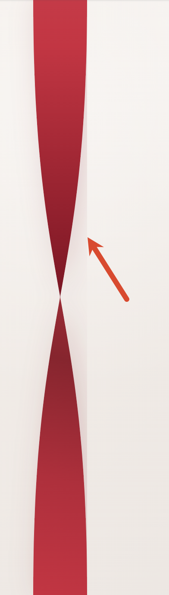
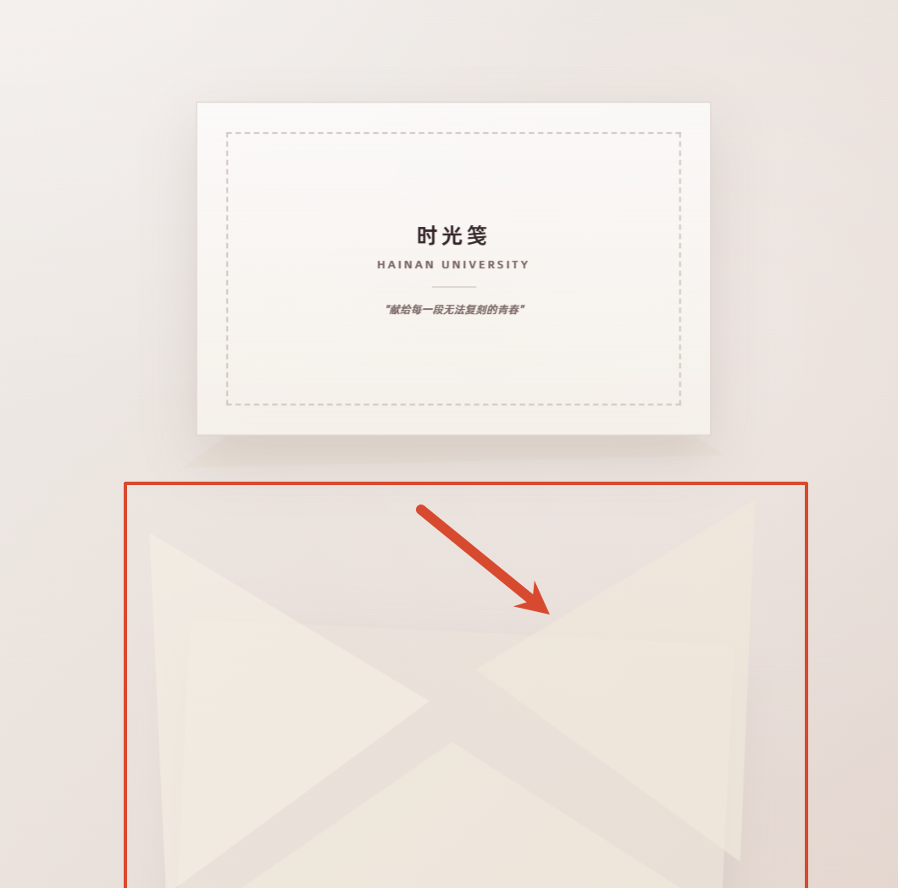

# 1.丝带

locator('.hero-ribbon-clip')

如截图箭头所示，这个 SVG 渲染后边缘出现了不该有的**半透明红色光晕（渲染伪影）**

# 2.火漆

getByRole('button', { name: '打开信封' })

这个图形是火漆，它应该是粘在信封上的。然后在鼠标放上去之后，它的大小不可以变，应该是固定不变的。在点击之后，应该是一个碎裂的动画。

# 3.信封整体

初始信封下落的动画，信封下落的过程非常卡顿，只有两三帧。不够丝滑。

在点击火漆之后，信封下落途中，信信封形态解体。应该保留完整的状态，而不是散成几个单独的三角形。如图

信纸在放大的过程中，放大的倍率不够大，没有覆盖整个屏幕。

# 4.背景色

全局设计系统规范的背景色#ece9e4 没有严格执行，开屏页和地图页背景依旧是其他颜色