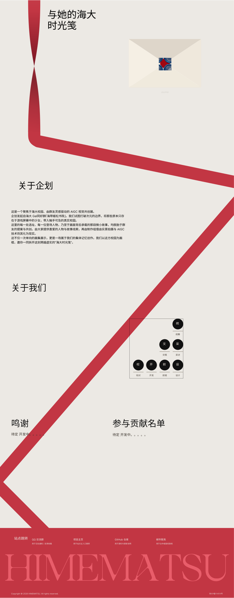
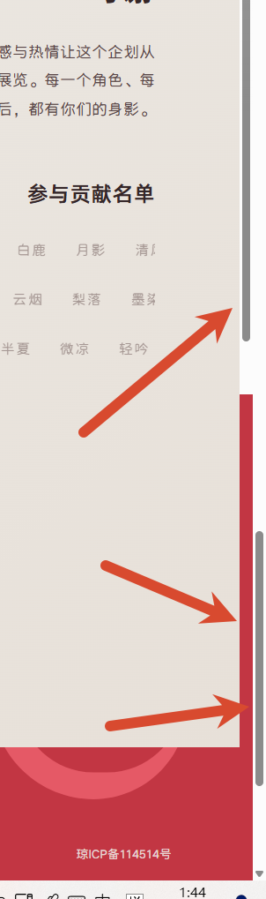

# 回顾

首先我们来回顾一下上一轮修复，看一下问题有没有解决。

1.丝带丝带出现的这个问题依然还没有解决。SVG 渲染后边缘出现了不该有的**半透明红色光晕（渲染伪影）**

2.火漆。我都说了火漆应该是粘在信封上的，应该是固定不动的。所以你为什么要在鼠标放上之后再加一个旋转呢？它就是一个静态的，固定在信封上面的内容。当然，你可以给它适当的加一个静止不动的，向逆时针的5%的倾角。

3.信封整体 修好了一部分，但又修坏了。首先是动效方面，它和旁边的丝带不是同时下落的，它的时间应该是慢几秒的，你可以看文档。然后要的飘落效果也没有了。然后信封的翻盖设计也被你修坏了。信纸在放大的过程中，依然没有覆盖整个屏幕，真正的解决办法应该是让它移动到视口正中心之后再放大。还有甚至就是那个“点击开始”那个提示的文字，应该是在信封下面，你还把它移位了。

4.背景色 开屏页依旧没有得到统一，把那该死的渐变背景给老子去了，只要纯色的背景#ece9e4。

我的评价是，你上次的修复任务就是一坨屎，根本不配你那 opus 的名号，我还不如找 chatGPT，你干不好，有的人是干得好！

# 新修复

1.首先是引导线的建立。你完全没弄好。

你首先要思考图层的位置关系，你要思考引导线，它作为一个跨度长达三个页面的图层，它的图层位置应该是在哪里？它应该是在字体之下。背景之上是一个独立的图层。其次就是关于这6个点，它们连接起来应该是一条完整的折线。你明白吗？它应该是完整的折线。也就是说，点4到点5，它应该是跨过了一个“关于我们”页面，到达了“鸣谢”页面。然后它和文字之间也也有交互关系。也就是说关于我们，它两个部分是被引导线给分割开来的。下面我附一张图，这是我设计稿里面图，你要严肃的参考这设计稿的图进行构建

2.你看看这张图。一定要读取图片。你自己看看，这像一个毫无前端开发经验的程序员做出来的东西。丑的令人发指。对于页脚的遮挡不够完全，然后以及出现两个滑动条，滑动关系也 混乱的一批。