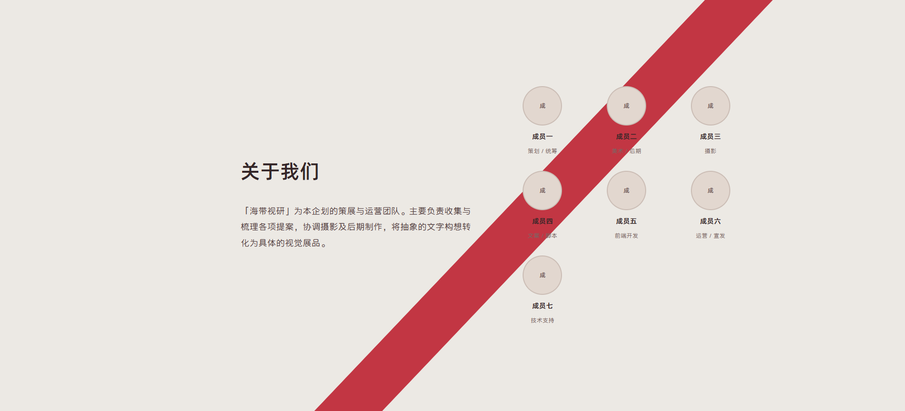
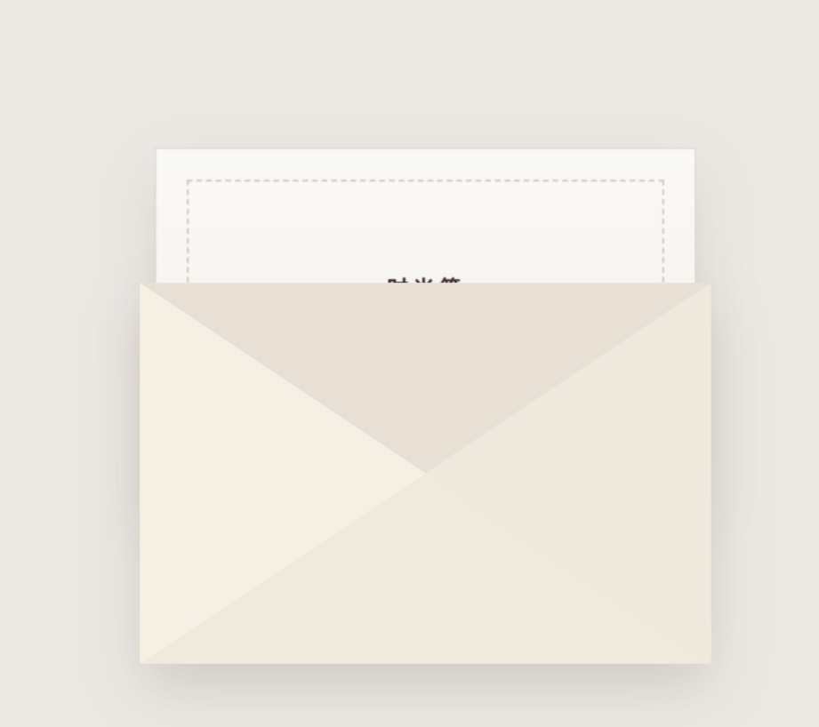

很好，你前面那一次修复很好，但是还是有一些小瑕疵，我们来为这个小瑕疵收尾。

1.引导线的首尾衔接问题。

请你一定要读取图片，读取我这两张图。首先是开头与第一页的丝带的衔接问题，它应该是我已经给好了位置，它应该先向下竖直的移动一段距离，然后再转弯，这样才能衔接上。你要进行稍微的调试，保证衔接自然。这个你需要反复确认。然后还有尾部的衔接问题，尾部应该伸进页脚的那一片红色里边，这个不知道是什么原因没有伸进去。

2.然后就是关于我们这个页面。

那个成员列表压住了红线，两块部分应该是分别左对齐和右对齐的。尽量不要压到引导线。然后成员列表的排列方式也可以进行优化一下。

3.还是那个信封的问题。信封打开的那个动画，那个翻，上面那个翻页的效果，它页面层级需要进行切换。你看如图所示，它那个翻页，上面那一个三角应该是在 那个卡片的后面的。原本是好的，被你修坏了，你还没修好它。然后在卡片放大之后，跳转到地图的中间，你需要做一个加载动画。不然页脚就会露出来。

4.然后你那个平滑滚动的效果还是没做的很好，我给你找了一个技巧，你按着上面的做。

读取 @todo\滚动.md