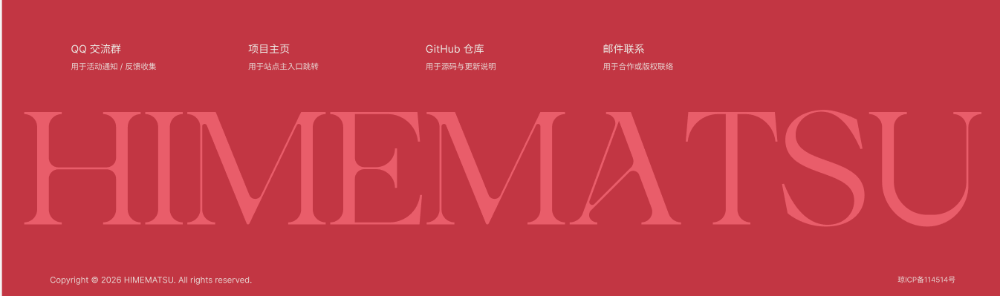

以下是开屏页向下滚动的“关于企划”，“关于我们”，”鸣谢“以及页脚的定义。

“关于企划”，“关于我们”，”鸣谢“这三个完整的页面每个都占满屏幕。

# 全局设定

**滑动规律**：基础位移遵循**线性插值 (Linear Interpolation)**，即滚动多少、移动多少。但视觉上显得极为丝滑，外层套用了一层**虚拟滚动动量 (Virtual Scroll Momentum)**，带有微小的物理阻尼 (Friction) 和惯性 (Inertia)

## 引导线

有一条横跨三个页面的，宽度为100 px 的#c23643红色折线引导线。它的图层顺序位于最底层，仅位于背景的上方。它的端点为圆角。接下来我将定义这个折线的每一个端点，通过它在哪一个页面的占比(页面左上角为0%,0%)来规定。

"关于企划页面"：点1（17.396%，0%) 点二（17.396%，0.5%) 点三（19.15%，7.50%）点四（107.5%，40.43%）

“鸣谢页面”：点五（-2.19%，65.40%）点六（32%，126.27%）

### 引导线动效运动逻辑

非可逆单向线性插值（Non-reversible Linear Interpolation）。摒弃双向同步映射，引入 `Math.max(cachedMaxScroll, currentScroll)` 算法作为绝对进度标量，构建单向锁定的运动矢量。视口在 Y 轴负向平移（向下滚动）时，SVG 红色几何路径的描边按比例实时进行正向曝光渲染；当视口在 Y 轴正向平移（向上回滚）时，路径端点坐标严格冻结（Freeze）在当前渲染周期内的历史最远端，无任何反向收缩或 `transform` 回退变形。再次向下滚动并越过已冻结坐标的 Y 值阈值时，插值计算无缝重连，路径继续沿预设矢量坐标集正向曝光。

# 页面详细设定

## “关于企划”页面

文案：

> 关于企划
>
> 这是一个聚焦于海大校园、由群友灵感驱动的 AIGC 视觉共创展。
> 企划发起自海大 Gal同好群⌈海带姬松书院⌋。我们试图打破次元的边界，将那些原本只存在于游戏屏幕中的少女，带入触手可及的真实校园。
> 这里的每一处选址、每一位登场人物，乃至于画面背后承载的那段微小故事，均脱胎于群友的提案与共创。由大家提供喜爱的人物与故事线索，再由制作组借由实景拍摄与 AIGC 技术将其化为现实。
> 这不仅一次单向的画集展示，更是一场属于我们的集体记忆创作。我们以这方校园为画框，邀你一同拆开这封跨越虚实的“海大时光笺”。

”关于我们“页面

构图：页面左侧为文案，右侧为人物圆形头像和昵称以及具体负责的职责展示页面，具，展示页面具体内容留空，大概有7个人。

文案：

> 关于我们
>
> 「海带视研」为本企划的策展与运营团队。主要负责收集与梳理各项提案，协调摄影及后期制作，将抽象的文字构想转化为具体的视觉展品。

“鸣谢”页面

构图：还明谢和参与贡献名单两块部分。整体偏右，向右侧对齐。然后”鸣谢“在“参与贡献名单”上方

> 文案：
> 鸣谢
>
> 待定开发中，大概100字

然后参与名单大概会有一个三排的横向滚动的昵称文字展示区域。

页脚

动效描述

**触发机制**：原生滚动条触底探测（`scrollHeight - clientHeight` 趋近极限值）。

运动规律判定：相对零速率视差（Relative Zero-velocity Parallax）。底层元素保持静止（`translateY: 0`），利用上方遮罩层的负向滚动位移制造揭露错觉。

现象详述：视口抵达文档末端区域时，底层红底与巨型 "HMEMATSU" 衬线字体层并非随内容区同步在 Y 轴上升，而是呈现出被上方主内容容器的底部边缘逐渐“揭开”（Reveal）的视觉切除（Clipping）假象。巨型文字层始终锚定在视口的底部固定坐标系内，无相对位移，仅其可视面积随遮罩层上移而正向增加。

构图：它从上到下分为大页脚、巨大化排版 logo 以及次页脚

中间的巨大化排版 logo 使用public\HIMEMATSU.svg 它响应式布局占满网页的宽度

具体设计内容使用 Figma MCP 读取Implement this design from Figma.
@https://www.figma.com/design/03Yk3qfAtt0OnFbcVV4pmg/hnu-timeletter?node-id=82-29&m=dev